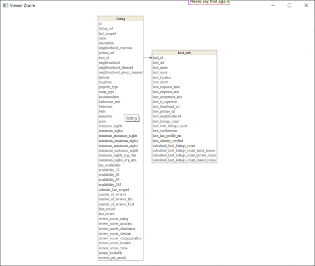

```{r setup, include=FALSE}
knitr::opts_chunk$set(echo = TRUE)
```

# Introduction

For this project, we demonstrate how to separate, clean and upload host and listing data taken from Airbnb for the city of Bangkok in Thailand.

<center> [The data for our project can be found here](http://insideairbnb.com/get-the-data.html) </center>

## Libraries

The following libraries are used for data cleaning and database construction

```{r, warning=FALSE, message=FALSE}
# Data cleaning libraries
library(readr)
library(tidyr)
library(stringr)
library(tibble)
library(dplyr) 

# Database libraries
library(DBI)
library(RSQLite)

# ER Diagram libraries
library(dm)
```


## Data/Database Connection

Begin by loading the downloaded data into R using the `read_csv()` command from the `readr` library.

```{r}
data <- read_csv("../data/listings.csv.gz")
```

We also need to form a database connection object:

```{r}
con <- dbConnect(RSQLite::SQLite(), "airdb.SQLite")
```

## Useful Functions

Before moving on to the data processing stage, we first define a few useful functions.

### The `remove_live_database()` function

While we are actively working on our database construction, we may find it useful to periodically disconnect and rebuild our database from scratch. Having to close `R`, delete the `airdb.SQLite` file and reopen our session repeatedly can be tedious. To work around this, we use the following `remove_live_database()` function to disconnect and delete any current working database while `R` is still open:

```{r}
remove_live_database <- function(con){
    if(file.exists("airdb.SQLite")){
        if (exists("con")){
            dbDisconnect(con)   
        }
        file.remove("airdb.SQLite")
    }
}
```

### The `insert_to_sql()` function

In order to facilitate the insertion of data into our `RSQLite` database, we use the following `insert_to_sql()` function. This function performs a number of operations prior to insertion:

  1. Create a vector of the column names in the provided the `data` argument.
  2. Makes sure that all `NA` values are in the correct form. For all non `NA` values, replace the double quotes with single quotes and bookend all strings with double quotes.
  3. Join all column data into a single string, transform `NA` values to `NULL` and trim all additional whitespace.
  4. Prepend and append each string with a left and right parentheses respectively before joining all values into a single string and removing all `\\`'s. Finally, use the `paste0()` function to convert our string into a query prior to insertion in our database's corresponding relevant table. 
  5. Insert the now prepared data into the database.
    

```{r}
insert_to_sql <- function(con, table, data){
    
    
    # (1)
    column_name <- paste(names(data), collapse = ", ")
    
    # (2)
    data_new <- data %>% 
        mutate_if(is.character, function(x) ifelse(is.na(x), NA,  x %>% 
                                str_replace_all('"', "'") %>% # Replace " with '
                                paste0('"', . , '"') # Add " before and after string
        )
        )
    
    value_data <- apply(data_new, MARGIN = 1,
                        function(x) x %>%
                            paste(collapse = ",") %>% # Join all column into single string
                            str_replace_all("\\bNA\\b", "NULL")  %>% # Create NULL from NA
                            str_trim() # remove unnecessary whitespace
    )
    # (4)
    query_value <- paste(value_data) %>% 
        paste0("(", ., ")") %>% # Add bracket before and after string
        paste(collapse = ", ") %>% # Join all values into single string
        str_remove_all("\\\\") %>% # Remove \\ from string
        paste0("INSERT INTO ", table, "(", column_name, ") VALUES ", .)
    
    # (5)
    dbSendQuery(con, query_value)
}
```

## Data

The data used in for this project is provided by Airbnb and can be found [here](http://insideairbnb.com/get-the-data.html). To get started, first download the `listings.csv.gz` from the provided link. In order to help streamline the process of constructing our database, it is beneficial to split the `.csv` file into a `listing` table and a `host_info` table. The E/R (Entity/Relationship) diagram in the next section shows how these two tables are related and the attributes they each hold. 

### E/R Diagram

```{r, echo=FALSE, out.width='1500px', out.height='800px'}
mydb <- dbConnect(RSQLite::SQLite(), "../airdb.SQLite")


#################### Getting table details
mydb_read <- dm_from_src(mydb)  

#################### Setting primary and foreign keys
mydb_w_key <- mydb_read %>%
    dm_add_pk(listing, id) %>%
    dm_add_pk(host_info, host_id) %>%
    
    dm_add_fk(listing, host_id, host_info) 

#################### Draw the schema
mydb_w_key %>% dm_draw(view_type = "all")
# 
```

From here, we will work on separating and cleaning the two respective tables prior to insertion in our database.

## Initial Data

We can examine our initial data using the `glimpse()` command from the `tibble` library.

```{r}
data %>% glimpse()
```

## Initial Preprocessing

Before we separate the data into two separate tables, we perform the following preprocessing steps on all entries:

  1. Convert all columns of the type `date` to the type `character` to help process `NA` values.
  2. Homogenize all of the different `NA` representations (blanks, None, N/A, NA) to `NA`.
  3. Convert all columns that contain dates back to the type `data`.

```{r}
data <- data %>% 
        # (1) Convert dates to characters for NA values
        mutate(last_scraped = as.character(last_scraped),
               host_since = as.character(host_since),
               calendar_last_scraped = as.character(calendar_last_scraped),
               first_review = as.character(first_review),
               last_review = as.character(last_review),
               ) %>% 
        
        # (2) Homogenize NA values
        #*# Taken from: https://rpubs.com/Argaadya/create_table_sql
        mutate_all(function(x) ifelse(x == "" | x == "None" | x == "N/A", NA, x)) %>%  #*#
        # mutate_all(function(x) ifelse(is.na(x), "NULL", x)) %>% 
        
        # (3) Convert character strings back to date type
        mutate(last_scraped = as.Date(last_scraped),
               host_since = as.Date(host_since),
               calendar_last_scraped = as.Date(calendar_last_scraped),
               first_review = as.Date(first_review),
               last_review = as.Date(last_review))
```

We are now ready to move on to constructing our `host_info` table.

# Host Table 

Since a host can have many listings, it's beneficial to split our initial data into two tables, one containing the info related to `hosts` and the other containing the info related to `listings`, before inserting into our database. The first table that we create, is the `host_info` table with the same attributes as shown in the E/R Diagram above. 


### Data Cleaning

We are now ready to extract and clean the data from our initial `data` table in order to construct our `host_data` table. This is done and the following four steps:

  1. Extract the relevant columns from our initial `data` table. Note that we use the `:` syntax to grab many columns at once. This syntax is inclusive.
  2. Remove duplicate rows using the `distinct()` function from the `dplyr` library.
  3. Convert the `host_since` column back to the type `character`. This is required since `RSQLite` does not support data of the type `date`. We will convert this column back to the correct type when performing queries later.
  4. Can we use the `str_remove_all()` function from the `stringr` library to convert the `host_verifications` sublists into simple strings. 
  
 <center> _e.g._ "['email', 'phone']"  $\rightarrow$ "email, phone". </center>

```{r}
    # (1) Extract host data 
    host_data <- data %>% 
        select(host_id:host_identity_verified, 
               calculated_host_listings_count:calculated_host_listings_count_shared_rooms)
    
    
    # (2) Remove duplicate values
    host_data <- host_data %>% distinct()
    
    
    # (3) Convert dates
    # Note that this will need to converted back to type = date for analysis
    host_data  <- host_data %>% mutate(host_since = as.character(host_since)) 
    
    
    # (4) Clean host verification column
    host_data <- 
        host_data %>% 
        mutate(host_verifications = str_remove_all(host_verifications, "[\\'\\[\\]]"))
```

We can now view our clean data:

```{r}
rmarkdown::paged_table(host_data)
```

### Host_info Table Creation

Now that our `host_data` table is clean. We can create the equivalent table as a query, initially as a string listing the table's columns, before creating the empty table in our database using our `con` object:

```{r}
# Create host info query
    query <- "CREATE TABLE host_info(
        host_id INT, 
        host_url VARCHAR(50), 
        host_name VARCHAR(100), 
        host_since VARCHAR(50),
        host_location VARCHAR(500), 
        host_about VARCHAR(10000),
        host_response_time VARCHAR(50),
        host_response_rate VARCHAR(50),
        host_acceptance_rate VARCHAR(50),
        host_is_superhost BOOLEAN,
        host_thumbnail_url VARCHAR(500),
        host_picture_url VARCHAR(500),
        host_neighbourhood VARCHAR(50),
        host_listings_count INT,
        host_total_listings_count INT,
        host_verifications VARCHAR(500),
        host_has_profile_pic BOOLEAN,
        host_identity_verified BOOLEAN,
        calculated_host_listings_count INT, 
        calculated_host_listings_count_entire_homes INT,
        calculated_host_listings_count_private_rooms INT,
        calculated_host_listings_count_shared_rooms INT,
        PRIMARY KEY(host_id)
        )"
```


### Data Insertion

Now create the empty table in our database.

```{r}
dbSendQuery(con, query)
```

### Schema Verification

Next, we check the schema of our database so far to ensure that it was loaded correctly.

```{r}
res <- dbSendQuery(con, "PRAGMA table_info([host_info]);")
fetch(res)
dbClearResult(res)
```

### Host Data Insertion

Finally, insert our `host_data` table into the equivalent table in our `RSQLite` database using the `insert_to_sql()` function as defined above.

```{r, echo = TRUE, results = 'hide'}
insert_to_sql(con, "host_info", host_data)
```


### Database Verification

We can verify the contents of our newly created and populated `RSQLite` database table `host_info` by viewing the first 10 rows of each column as follows: 

```{r}
res <- dbSendQuery(con, "SELECT * FROM host_info LIMIT 10") 

out_db <- fetch(res) 
dbClearResult(res)

rmarkdown::paged_table(out_db)
```


# Listing Table 

We are now ready to move on to constructing our `listing` table. This table contains information related to the types of listings available and their relevant attributes. The process of constructing the `listing` table is very similar to the process of constructing the `host_info` table. 

### Data Cleaning

In order to prepare the relevant columns related to listing information we perform the following:

  1. Remove all columns related to `host_data`.
  2. Remove additional unnecessary columns.
  3. Remove the dollar signs in the `price` column.
  4. Perform the same transformation as we did above on the `host_verifications` column to the `amenities` column.
  5. Convert all columns of the type `date` to the type `character` as is required for insertion into our database.

```{r}
# (1) Remove host_data columns
listing_data <- data %>% 
    select( - names(host_data)[-1])


# (2) Remove extraneous columns 
listing_data <- listing_data %>% 
    select(-c(license, calendar_updated, bathrooms, scrape_id))


# (3) Remove dollar signs from price column
listing_data <- listing_data %>% 
    mutate(price = str_remove_all(price, "[$,]") %>% 
               as.numeric()
    )

# (4) Transform amenities and host verification column
listing_data <- listing_data %>% 
    mutate(amenities = str_remove_all(amenities, "[\"\\'\\[\\]]"))


# (5)  Convert dates to character
listing_data <- 
    listing_data %>% 
    mutate(last_scraped          = as.character(last_scraped), 
           calendar_last_scraped = as.character(calendar_last_scraped),
           first_review          = as.character(first_review),
           last_review           = as.character(last_review))
```

### Listing Table Creation

Just as before, create our `listing` database table initially as a string to be inserted as a query.

```{r}
# Create listing table query
    query_2 <- "CREATE TABLE listing (
        id INT,
        listing_url VARCHAR(100),
        last_scraped VARCHAR(50),
        name VARCHAR(500),
        description VARCHAR(2000),
        neighborhood_overview VARCHAR(2000),
        neighbourhood VARCHAR(100),
        neighbourhood_cleansed VARCHAR(100),
        neighbourhood_group_cleansed VARCHAR(100),
        latitude DECIMAL(25,18),
        longitude DECIMAL(25, 18),
        property_type VARCHAR(100),
        room_type VARCHAR(100),
        picture_url VARCHAR(500),
        host_id INT,
        accommodates INT,
        bathrooms_text VARCHAR(100),
        bedrooms INT,
        beds INT,
        amenities VARCHAR(2000),
        price DECIMAL(15, 5),
        minimum_nights INT,
        maximum_nights INT,
        minimum_minimum_nights INT,
        maximum_minimum_nights INT,
        minimum_maximum_nights INT,
        maximum_maximum_nights INT,
        minimum_nights_avg_ntm DECIMAL(16, 5),
        maximum_nights_avg_ntm DECIMAL(16, 5),
        has_availability BOOLEAN,
        availability_30 INT,
        availability_60 INT,
        availability_90 INT,
        availability_365 INT,
        calendar_last_scraped VARCHAR(50),
        number_of_reviews INT,
        number_of_reviews_ltm INT,
        number_of_reviews_l30d INT,
        first_review VARCHAR(50),
        last_review VARCHAR(50),
        review_scores_rating DECIMAL(10, 5),
        review_scores_accuracy DECIMAL(10, 5),
        review_scores_cleanliness DECIMAL(10, 5),
        review_scores_checkin DECIMAL(10, 5),
        review_scores_communication DECIMAL(10, 5),
        review_scores_location DECIMAL(10, 5),
        review_scores_value DECIMAL(10, 5),
        instant_bookable BOOLEAN,
        reviews_per_month DECIMAL(10, 5),
        PRIMARY KEY(id),
        FOREIGN KEY(host_id) REFERENCES host_info(host_id)
    )"
```

### Table Insertion

Insert the `listing` table into our database.

```{r}
dbSendQuery(con, query_2)
```


### Data Insertion

Insert the `listing` data into our database using the same `insert_to_sql()` function as before.

```{r, echo = TRUE, results = 'hide'}
insert_to_sql(con, "listing", listing_data)
```


### Database Verification

Confirm that the data was indeed inserted correctly.

```{r}
res <- dbSendQuery(con, "SELECT * FROM listing LIMIT 10")

out_db <- fetch(res)
dbClearResult(res)

rmarkdown::paged_table(out_db)
```
### Database Disconnect

Finally, before exiting our program, disconnect from the database

```{r}
dbDisconnect(con)
```


## Conclusion

We have provided an example of how to pull real-world data from an actual source, then separate, clean and load the data into a `RSQLite` database. Real-world data is often times initially messy, but that does not mean it cannot be wrangled into a form from which we can gain deeper insights. In our next post, we demonstrate how to answer some interesting questions given our newly created database.


